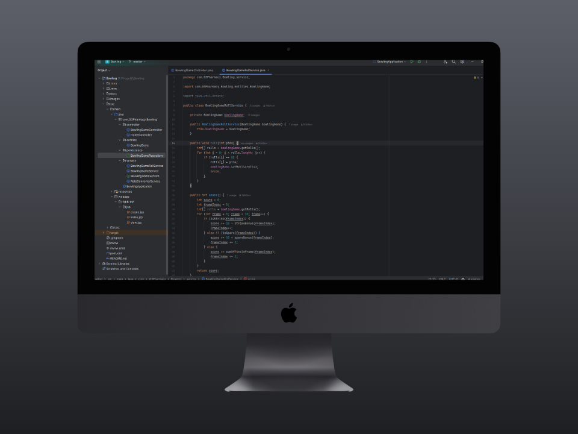

<!-- PROJECT SHIELDS -->
<!--
*** I'm using markdown "reference style" links for readability.
*** Reference links are enclosed in brackets [ ] instead of parentheses ( ).
*** See the bottom of this document for the declaration of the reference variables
*** for contributors-url, forks-url, etc. This is an optional, concise syntax you may use.
*** https://www.markdownguide.org/basic-syntax/#reference-style-links
-->

<!-- PROJECT LOGO -->
<!-- -->
<br />
<div align="center" id="readme-top">
  <a href="https://www.sydema.it/" target="_blank" rel="noopener" alt="Logo">
    
  
  </a>

  <h1 align="center">Bownling Game</h1>

  <p align="center">
    This project is based in Spring Bot, Spring Data & Spring Web. The main goal is to create a simple API to manage a Bowling Game.
    <br />
    <a href="https://spring.io/" target="_blank" rel="noopener"><strong>Explore the docs »</strong></a>
    <br />
    <br />
    <a href="https://github.com/Nib1sin/Bowling-project-for-G3Pharmacy" target="_blank" rel="noopener">View Demo</a>·
    <a href="https://www.cgm.com" target="_blank" rel="noopener">Request Feature</a>
  </p>
</div>


<!-- TABLE OF CONTENTS -->
<details>
  <summary style="font-size: 20px;">👇 Table of Contents</summary>
  <ol>
    <li>
      <a href="#💻-about-the-project">About The Project</a>
      <ul>
        <li><a href="#💼-built-with">Built With</a></li>
      </ul>
    </li>
    <li>
      <a href="#🗄️-getting-started">Getting Started</a>
      <ul>
        <li><a href="#📂-prerequisites">Prerequisites</a></li>
        <li><a href="#💡-optional">Prerequisites</a></li>
        <li><a href="#👷-installation">Installation</a></li>
      </ul>
    </li>
    <li><a href="#🧑‍💻-usage">Usage</a></li>
    <li><a href="#📑-license">License</a></li>
    <li><a href="#📠-contact">Contact</a></li>
    <li><a href="#acknowledgments">Acknowledgments</a></li>
  </ol>
</details>


</br>

<!-- ABOUT THE PROJECT -->
## 💻 About The Project
<!---->
<a href="https://github.com/Nib1sin/Bowling-project-for-G3Pharmacy" target="_blank" rel="noopener">
    <p align="center">

 
    </p>
</a>


<p align="center">

[![License][License]][License-url] [![Contributor][Contributor]][Contributor-url] [![Owner][Owner]][Owner-url] [![Branch][Branch]][Branch-url]
</p>


### 💼 Built With
This project has been builded with the following technologies/frameworks:

[![Java8][Java8]][Java8-url]
[![Spring][Spring]][Spring-url]
[![XML][XML]][XML-url]
[![MAVEN][MAVEN]][MAVEN-url]
[![MYSQL][MYSQL]][MYSQL-url]

<p align="right">[<a href="#readme-top">back to top</a>]</p>


Here's why:
* Your time should be focused on creating something amazing. A project that solves a problem and helps others
<p align="right">[<a href="#readme-top">back to top</a>]</p>


<!-- GETTING STARTED -->
## 🗄️ Getting Started
To get a local copy up and running follow these simple example steps.

### 📂 Prerequisites

`Git`

Install git from the official repository
  ```html
    https://git-scm.com/download/win
  ```

`Java 17`

Install Java from the official repository
  ```html
    https://www.oracle.com/java/technologies/javase/jdk17-archive-downloads.html
  ```  

`Maven`

Install Gradle from the official repository
  ```html
    https://maven.apache.org/install.html
  ```


### 💡 Optional

`STS`

In this case, im using Sts 3.8.4 as IDE. You can download the IDE from the STS official site
  ```html
    https://spring.io/blog/2017/04/03/spring-tool-suite-3-8-4-released/
  ```

`Tomcat`

We can use Tomcat for testing in our local enviroment, download tomcat client and add the `ojdbc8` library into tomcat's libs
  ```html
    https://tomcat.apache.org/download-90.cgi
  ```
  

### 👷 Installation

_In this case im using the main branch [master]._

1. Clone the repository
```sh
    git clone git@github.com:Nib1sin/Bowling-project-for-G3Pharmacy.git
  ```

2. Create a Workspeace for the project
```sh
   mkdir /WorkSpace_Bowling
```

3. Import the project with the gradle.plugin


<p align="right">[<a href="#readme-top">back to top</a>]</p>


<!-- USAGE EXAMPLES -->
## 🧑‍💻 Usage

In this project we similute a Bowling Game, where we can create a game, add players and add scores to the players.
The structure of the project is as follows:

`Controller` :
_In this package we have the controllers for the API_

`Service` :
_In this package we have the services for the API_

`Persistence` :
_In this package we have the repositories for the API_

`Entities` :
_In this package we have the entities for the API_


_For more examples, please refer to the [Documentation](https://github.com/Nib1sin/Bowling-project-for-G3Pharmacy/blob/master/docs/Bowling.pdf)_

<p align="right">[<a href="#readme-top">back to top</a>]</p>


<!-- LICENSE -->
## 📑 License

Distributed under the MIT's License. For more information see all detais on [MIT's license](https://es.wikipedia.org/wiki/Licencia_MIT)

<p align="right">[<a href="#readme-top">back to top</a>]</p>


<!-- CONTACT -->
## 📠 Contact

Pedro Jaime - [nibi.amdukia@gmail.com](mailto:nibi.amdukia@gmail.com)

Project Link: [Bowling](https://github.com/Nib1sin/Bowling-project-for-G3Pharmacy)

<p align="right">[<a href="#readme-top">back to top</a>]</p>


<!-- ACKNOWLEDGMENTS -->
## Acknowledgments

In order to be able to develop/implement code for the proper development of the application, we highly recommend reading the following documentation:

* [Git Tutorial](https://git-scm.com/docs/gittutorial)
* [Gradle Guide](https://gradle.org/guides/)
* [Learn Groovy](https://groovy-lang.org/learn.html)
* [Spring Batch](https://spring.io/projects/spring-batch#learn)
* [Java tutorial](https://docs.oracle.com/javase/tutorial/)
* [Oracle Database Quick Start](https://www.oracle.com/webfolder/technetwork/tutorials/obe/db/12c/r1/odb_quickstart/odb_quick_start.html)


<p align="right">[<a href="#readme-top">back to top</a>]</p>


<!-- MARKDOWN LINKS & IMAGES -->
<!-- https://www.markdownguide.org/basic-syntax/#reference-style-links -->

[product-screenshot]: images/Spring_Batch.png
[Java8]: https://img.shields.io/badge/java-%23E34F26.svg?style=for-the-badge&logo=openjdk&logoColor=white
[Java8-url]: https://www.java.com/it/download/help/java8.html
[Spring]: https://img.shields.io/badge/spring-%236DB33F.svg?style=for-the-badge&logo=spring&logoColor=white
[Spring-url]: https://spring.io/projects/spring-batch
[Gradle]: https://img.shields.io/badge/Gradle-02303A.svg?style=for-the-badge&logo=Gradle&logoColor=white
[Gradle-url]: https://gradle.org/
[Groovy]: https://img.shields.io/badge/Apache%20Groovy-4298B8.svg?style=for-the-badge&logo=Apache+Groovy&logoColor=white
[Groovy-url]: https://groovy-lang.org/
[Oracle]: https://img.shields.io/badge/Oracle-F80000?style=for-the-badge&logo=oracle&logoColor=white
[Oracle-url]: https://groovy-lang.org/
[XML]: https://img.shields.io/badge/Xml-%23FF9900?style=for-the-badge&logo=oracle&logoColor=white
[XML-url]: https://support.microsoft.com/it-it/office/informazioni-di-base-su-xml-a87d234d-4c2e-4409-9cbc-45e4eb857d44
[MAVEN]: https://img.shields.io/badge/Apache%20Maven-C71A36?style=for-the-badge&logo=Apache%20Maven&logoColor=white
[MAVEN-url]: https://maven.apache.org/
[MYSQL]: https://img.shields.io/badge/mysql-4479A1.svg?style=for-the-badge&logo=mysql&logoColor=white
[MYSQL-url]: https://www.mysql.com/


[License]: ./images/license_mit.svg
[License-url]: https://en.wikipedia.org/wiki/MIT_License
[Contributor]: ./images/main_contributor.png
[Contributor-url]: mailto:nibi.amdukia@gmail.com
[Owner]: ./images/owner_project.svg
[Owner-url]: mailto:nibi.amdukia@gmail.com
[Branch]: ./images/current_branch.png
[Branch-url]: https://github.com/Nib1sin/Bowling-project-for-G3Pharmacy
